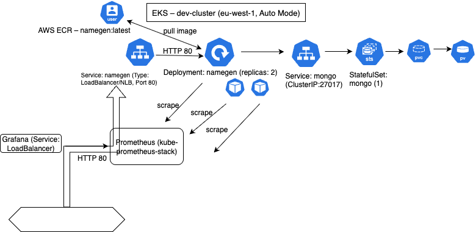

# 🚀 EKS with CI/CD – Random Name Generator (user5)

<div align="center">

[](https://kubernetes.io/)
[](https://aws.amazon.com/eks/)
[](https://www.docker.com/)
[](https://nodejs.org/)
[](https://www.mongodb.com/)
[](https://prometheus.io/)
[](https://grafana.com/)

</div>

Production-style deployment of a **Random Name Generator** on **AWS EKS (Auto Mode)** with:
- Private **AWS ECR** image
- **GitHub Actions** CI/CD (build → push → deploy)
- **NLB** exposure for the app
- **MongoDB 3.6** via **StatefulSet + PVC** (EBS CSI)
- **Prometheus + Grafana** monitoring (Helm `kube-prometheus-stack`)

---

## 📚 Table of Contents
- [Overview](#overview)
- [Architecture](#architecture)
- [Tech Stack](#tech-stack)
- [Repository Structure](#repository-structure)
- [CI/CD Pipeline](#cicd-pipeline)
- [How to Run](#how-to-run)
- [Monitoring](#monitoring)
- [Screenshots](#screenshots)
- [Configuration](#configuration)
- [Troubleshooting](#troubleshooting)
- [Cleanup](#cleanup)

---

## Overview

- **Cluster**: `dev-cluster` (region `eu-west-1`) – EKS **Auto Mode**
- **Image Registry**: Private ECR – `339712888957.dkr.ecr.eu-west-1.amazonaws.com/namegen:latest`
- **Application**: Node.js service that generates and stores random names in MongoDB
- **Database**: MongoDB **3.6** (StatefulSet + PVC)
- **Exposure**: Service `namegen` Type **LoadBalancer** → **NLB** on port **80**
- **Monitoring**: `kube-prometheus-stack` (Prometheus, Alertmanager, Grafana). Grafana is exposed via `LoadBalancer`.

---

## Architecture



### Application Flow

| Component         | Technology          | Purpose                                      |
|------------------:|---------------------|----------------------------------------------|
| Frontend          | HTML/CSS/JS         | Static web page                              |
| Backend           | Node.js / Express   | REST API                                     |
| Database          | MongoDB 3.6         | Persistent storage                           |
| Load Balancer     | AWS NLB             | External access & high availability          |
| Monitoring        | Prometheus/Grafana  | Metrics collection and visualization         |

**Left → Right**
1. GitHub Actions builds an image and pushes to **ECR**.
2. Deployment `namegen` pulls from ECR and runs **2 replicas**.
3. Service `namegen` (Type=LoadBalancer) creates an **NLB** (HTTP 80).
4. Service `mongo` (ClusterIP) targets a **StatefulSet** with **PVC** (EBS CSI).
5. **Prometheus** scrapes metrics; **Grafana** displays dashboards.

---

## 🛠️ Tech Stack

### Core Application
| Technology  | Version | Purpose         |
|-------------|---------|-----------------|
| Node.js     | 18 LTS  | Runtime         |
| Express     | 4.18+   | Web framework   |
| MongoDB     | 3.6     | NoSQL database  |

### DevOps & Infrastructure
| Technology        | Purpose                                   |
|-------------------|-------------------------------------------|
| Docker            | Build container image                      |
| Kubernetes        | Orchestration on EKS                       |
| AWS EKS (Auto)    | Managed cluster                            |
| AWS ECR (private) | Container registry                         |
| AWS EBS (CSI)     | Persistent volumes (PVC/PV)                |
| AWS NLB           | External access via Service LoadBalancer   |
| Helm              | `kube-prometheus-stack` for monitoring     |

### Monitoring & Security
| Technology  | Purpose                     |
|-------------|-----------------------------|
| Prometheus  | Metrics scrape & storage    |
| Grafana     | Dashboards                  |
| RBAC        | Access control in K8s       |
| Secrets     | Credentials (GitHub/K8s)    |

---

## Repository Structure
.
├─ .github/workflows/
│ └─ deploy.yml
├─ k8s-manifests/
│ ├─ app.yml
│ ├─ app_svc.yml
│ ├─ mongodb.yml
│ └─ db_svc.yml
├─ screenshots/
│ └─ *.png (diagrams & proof screenshots)
├─ Dockerfile
├─ server.js
├─ package.json
└─ README.md


---

## 🔁 CI/CD Pipeline

- Workflow: `.github/workflows/deploy.yml`
- Steps:
  1. Configure AWS credentials (GitHub Secrets)
  2. Login to **ECR (private)**
  3. **Build** Docker image → **Tag** as `namegen:latest`
  4. **Push** to `339712888957.dkr.ecr.eu-west-1.amazonaws.com/namegen:latest`
  5. `aws eks update-kubeconfig --name dev-cluster --region eu-west-1`
  6. `kubectl apply -n namegen -f k8s-manifests/`
  7. Force image update + rollout:
     ```
     kubectl set image deployment/namegen namegen=$IMAGE -n namegen
     kubectl rollout status deployment/namegen -n namegen
     ```

**GitHub Secrets required**
- `AWS_ACCESS_KEY_ID`
- `AWS_SECRET_ACCESS_KEY`

---

## How to Run

> Cluster already exists: `dev-cluster` (region `eu-west-1`)

```bash
# 1) Clone
git clone https://github.com/levanabas/Generator-eks-project.git
cd Generator-eks-project

# 2) Connect kubectl
aws eks update-kubeconfig --name dev-cluster --region eu-west-1
kubectl get nodes

# 3) Deploy app + DB (namespace: namegen)
kubectl apply -n namegen -f k8s-manifests/
kubectl get pods -n namegen
kubectl get svc  -n namegen

# 4) Get external URL (NLB)
kubectl get svc namegen -n namegen \
  -o jsonpath='{.status.loadBalancer.ingress[0].hostname}{"\n"}'
# open http://<hostname>/


Monitoring

Install (if needed):

kubectl create ns monitoring || true

helm repo add prometheus-community https://prometheus-community.github.io/helm-charts
helm repo update

helm upgrade --install monitoring prometheus-community/kube-prometheus-stack \
  --namespace monitoring \
  --set grafana.service.type=LoadBalancer \
  --set prometheus.service.type=LoadBalancer

Access:

# Grafana
kubectl -n monitoring get svc monitoring-grafana \
  -o jsonpath='{.status.loadBalancer.ingress[0].hostname}{"\n"}'

# Grafana admin password
kubectl -n monitoring get secret monitoring-grafana \
  -o jsonpath="{.data.admin-password}" | base64 -d; echo

# Prometheus
kubectl -n monitoring get svc monitoring-kube-prometheus-prometheus \
  -o jsonpath='{.status.loadBalancer.ingress[0].hostname}{"\n"}'

📷 Screenshots

CI Pipeline – screenshots/ci_pipeline.png

EKS Cluster – screenshots/cluster.png

Kubernetes Pods – screenshots/pods.png

Grafana – screenshots/grafana.png

App UI – screenshots/appRandomName.png

Architecture Diagram – screenshots/diagram.drawio.png


Configuration
Environment Variables
Variable	Description	Example
MONGODB_URL	Mongo connection string	mongodb://mongo/namegen
PORT	App port	8080
Kubernetes (in k8s-manifests/)

app.yml – Deployment namegen (2 replicas) + env MONGODB_URL

app_svc.yml – Service namegen (LoadBalancer/NLB, port 80)

mongodb.yml – StatefulSet mongo + PVC

db_svc.yml – Service mongo (ClusterIP)

Troubleshooting
kubectl get events -A --sort-by=.lastTimestamp | tail -n 50
kubectl -n namegen describe svc namegen
kubectl -n namegen rollout status deploy/namegen
kubectl -n namegen logs deploy/namegen --tail=100
kubectl -n namegen get svc namegen -o wide

Notes

If EXTERNAL-IP is pending, wait a few minutes for the NLB to provision.

For Mongo issues, check PVC/PV: kubectl get pvc -n namegen

Cleanup
# App + DB
kubectl delete ns namegen --ignore-not-found

# Monitoring
helm -n monitoring uninstall monitoring || true
kubectl delete ns monitoring --ignore-not-found

Registry: delete images in ECR if you want to stop pulls and save cost.


::contentReference[oaicite:0]{index=0}


