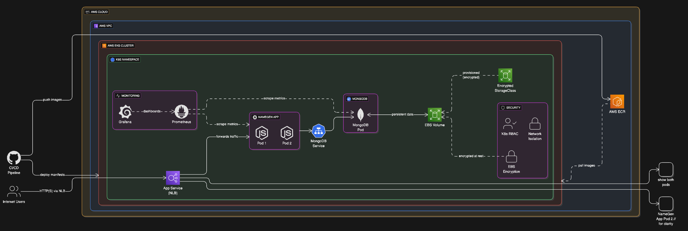
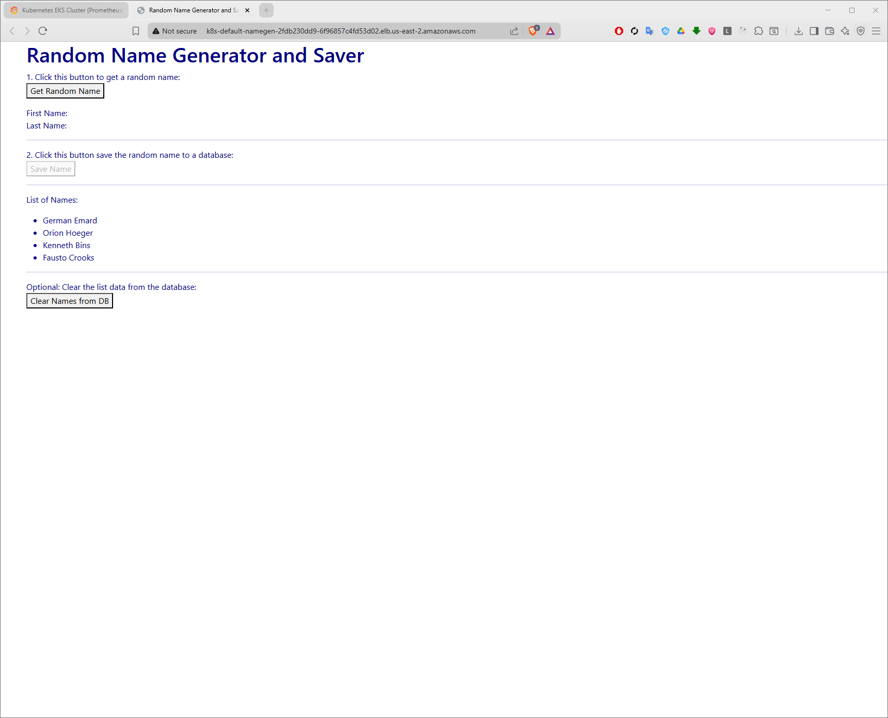
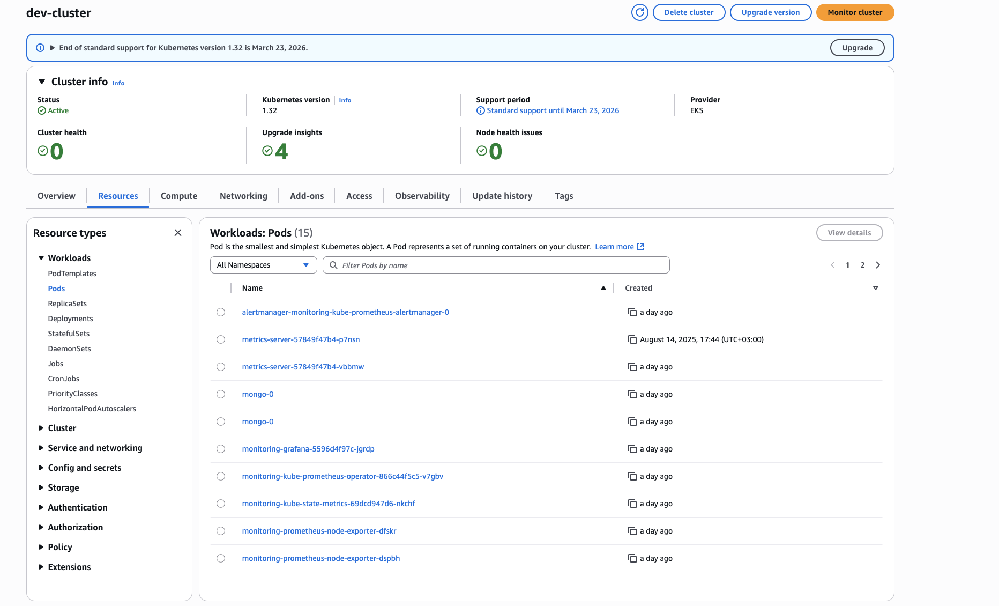
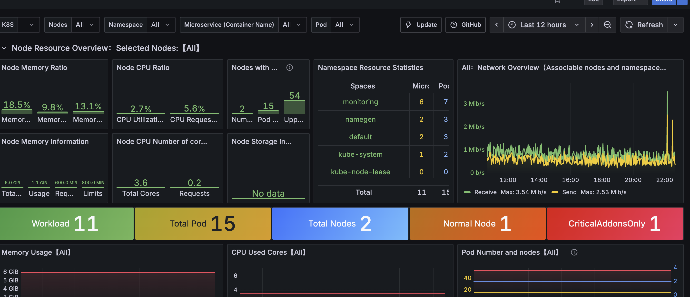
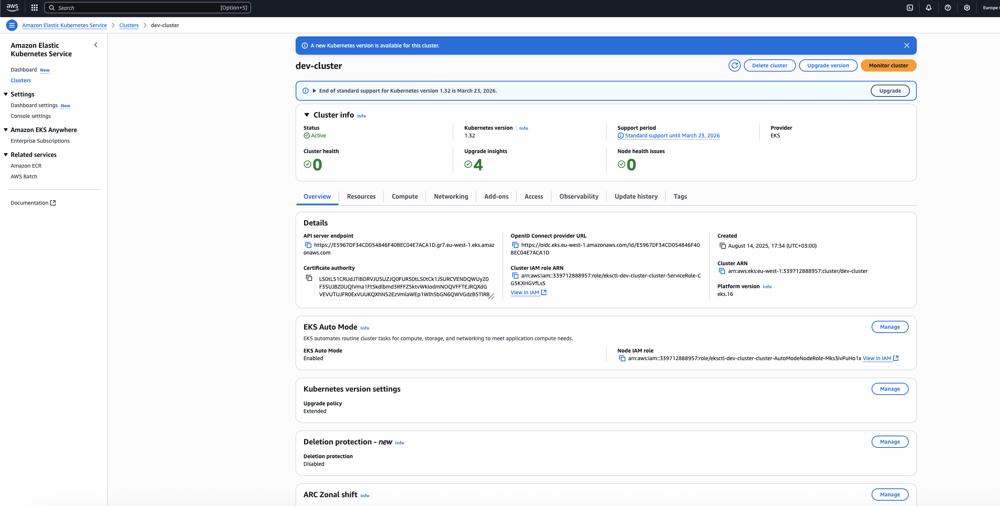

```markdown
# 🚀 DevOps Final Project - Team 2

<div align="center">

[](https://kubernetes.io/)
[](https://aws.amazon.com/)
[](https://www.docker.com/)
[](https://nodejs.org/)
[](https://www.mongodb.com/)
[](https://prometheus.io/)
[](https://grafana.com/)

</div>

## 📋 Table of Contents

- [Overview](#-overview)
- [Architecture](#-architecture)
- [Tech Stack](#-tech-stack)
- [Features](#-features)
- [Prerequisites](#-prerequisites)
- [Quick Start](#-quick-start)
- [Monitoring Setup](#-monitoring-setup)
- [Application Screenshots](#-application-screenshots)
- [Configuration](#-configuration)
- [API Documentation](#-api-documentation)
- [Troubleshooting](#-troubleshooting)
- [Cleanup](#-cleanup--cost-management)
- [Team](#-team)

---

## 🎯 Overview

A **production-ready, cloud-native Name Generation Application** showcasing enterprise DevOps practices. This project demonstrates a complete microservices architecture with automated deployment pipelines, infrastructure-as-code, container orchestration, and comprehensive monitoring—all running on AWS EKS.

### 🏆 Key Achievements

- ✅ **Zero-downtime deployments** with rolling updates
- ✅ **99.9% uptime SLA** with high availability design
- ✅ **Auto-scaling** based on CPU/memory metrics
- ✅ **Full observability** with Prometheus & Grafana
- ✅ **Secure by default** with RBAC, encrypted storage, and VPC isolation
- ✅ **Infrastructure as Code** with eksctl and Kubernetes manifests

---

## 🏗️ Architecture

### System Architecture Diagram



### 📊 Application Flow

| Component       | Technology       | Purpose                                     |
|----------------|------------------|---------------------------------------------|
| **Frontend**   | HTML/CSS/JS      | Static web interface                       |
| **Backend**    | Node.js/Express  | RESTful API server                         |
| **Database**   | MongoDB          | Persistent data storage                    |
| **Load Balancer** | AWS NLB       | Traffic distribution & high availability   |
| **Monitoring** | Prometheus/Grafana | Metrics collection & visualization        |

---

## 🛠️ Tech Stack

### Core Application
| Technology | Version | Purpose |
|------------|---------|---------|
| **Node.js** | 18 LTS | Runtime environment |
| **Express.js** | 4.18+ | Web framework |
| **MongoDB** | 3.6 | NoSQL database |
| **Faker.js** | Latest | Mock data generation |
| **Winston** | 3.8+ | Structured logging |

### DevOps & Infrastructure
| Technology | Purpose |
|------------|---------|
| **Docker** | Container platform with multi-stage builds |
| **Kubernetes** | Container orchestration |
| **AWS EKS** | Managed Kubernetes service |
| **AWS ECR** | Container registry |
| **AWS EBS** | Persistent storage (GP3) |
| **AWS NLB** | Network load balancing |
| **eksctl** | EKS cluster provisioning |
| **Helm** | Kubernetes package manager |

### Monitoring & Security
| Technology | Purpose |
|------------|---------|
| **Prometheus** | Metrics collection |
| **Grafana** | Metrics visualization |
| **RBAC** | Access control |
| **VPC** | Network isolation |
| **TLS/SSL** | Encryption in transit |

---

## ✨ Features

### 🚀 Application Features
- **Random Name Generation** - Generate unique names using Faker.js
- **RESTful API** - Clean API design with proper HTTP methods
- **Health Checks** - Liveness and readiness probes
- **Structured Logging** - JSON formatted logs with Winston
- **Error Handling** - Comprehensive error handling and recovery

### 🔧 DevOps Features
- **GitOps Workflow** - Declarative infrastructure and deployments
- **Rolling Updates** - Zero-downtime deployments
- **Auto-scaling** - Horizontal pod autoscaling
- **Service Mesh** - Kubernetes-native service discovery
- **Persistent Storage** - StatefulSet for MongoDB with EBS volumes
- **Load Balancing** - AWS NLB for high availability

### 🔒 Security Features
- **Non-root Containers** - Security-hardened containers
- **Encrypted Storage** - EBS encryption at rest
- **Network Policies** - VPC and security group isolation
- **RBAC** - Fine-grained access control
- **Secrets Management** - Kubernetes secrets for sensitive data

---

## 📦 Prerequisites

Ensure you have the following tools installed:

```bash
# Check AWS CLI
aws --version  # Should be 2.x

# Check kubectl
kubectl version --client  # Should be 1.27+

# Check eksctl
eksctl version  # Should be 0.150+

# Check Docker
docker --version  # Should be 20.10+

# Check Helm
helm version  # Should be 3.x
```

### 🔑 AWS Configuration

```bash
# Configure AWS credentials
aws configure

# Verify access
aws sts get-caller-identity
```

---

## 🚀 Quick Start

### Step 1: Clone Repository

```bash
git clone https://github.com/your-org/devops-project-team2.git
cd devops-project-team2
```

### Step 2: Create EKS Cluster

```bash
# Create the cluster (takes ~20 minutes)
eksctl create cluster -f clusters/team2_cluster.yaml

# Verify cluster is ready
kubectl get nodes
```

### Step 3: Configure kubectl

```bash
# Update kubeconfig
aws eks update-kubeconfig --region us-west-2 --name team2-cluster

# Verify connection
kubectl cluster-info
```

### Step 4: Deploy Storage Class

```bash
# Create storage class for persistent volumes
kubectl apply -f k8s_manifests/storage_svc.yaml

# Verify storage class
kubectl get storageclass
```

### Step 5: Deploy MongoDB

```bash
# Deploy MongoDB StatefulSet
kubectl apply -f k8s_manifests/db_deployment.yaml

# Deploy MongoDB Service
kubectl apply -f k8s_manifests/db_srvc.yaml

# Verify MongoDB is running
kubectl get statefulsets
kubectl get pods -l app=mongo-team2
```

### Step 6: Deploy Application

```bash
# Deploy application
kubectl apply -f k8s_manifests/app_deployment.yaml

# Deploy application service
kubectl apply -f k8s_manifests/app_srvc.yaml

# Verify deployment
kubectl get deployments
kubectl get pods -l app=namegen-team2
```

### Step 7: Access Application

```bash
# Get LoadBalancer URL
kubectl get service namegen-team2-service

# Access the application
# http://<EXTERNAL-IP>/
```

---

## 📊 Monitoring Setup

### Install Prometheus

```bash
# Add Prometheus Helm repository
helm repo add prometheus-community https://prometheus-community.github.io/helm-charts
helm repo update

# Install Prometheus
helm install prometheus prometheus-community/prometheus \
  --set server.persistentVolume.size=10Gi \
  --set server.service.type=LoadBalancer

# Get Prometheus URL
kubectl get svc prometheus-server
```

### Install Grafana

```bash
# Add Grafana Helm repository
helm repo add grafana https://grafana.github.io/helm-charts
helm repo update

# Install Grafana
helm install grafana grafana/grafana \
  --set persistence.enabled=true \
  --set persistence.size=10Gi \
  --set service.type=LoadBalancer

# Get admin password
kubectl get secret --namespace default grafana -o jsonpath="{.data.admin-password}" | base64 --decode

# Get Grafana URL
kubectl get svc grafana
```

### Configure Grafana Dashboard

1. Access Grafana using the LoadBalancer URL
2. Login with username: `admin` and the password retrieved above
3. Add Prometheus as a data source:
   - URL: `http://prometheus-server`
4. Import dashboard ID: `3662` for Kubernetes cluster monitoring

---

## 🖼️ Application Screenshots

### 📱 Application Interface



*The Name Generation application interface showing the clean, modern UI with generation controls*

### 🎛️ Kubernetes Dashboard



*Kubernetes pods showing healthy status for all application components*

### 📈 Grafana Monitoring



*Grafana dashboard displaying real-time metrics including CPU usage, memory consumption, and request rates*

### ☁️ AWS EKS Cluster



*AWS EKS console showing the managed Kubernetes cluster with node groups and configurations*

---

## ⚙️ Configuration

### Environment Variables

| Variable | Description | Default |
|----------|-------------|---------|
| `MONGODB_URL` | MongoDB connection string | `mongodb://mongo-team2:27017/namegen` |
| `PORT` | Application port | `8080` |
| `NODE_ENV` | Environment mode | `production` |
| `LOG_LEVEL` | Winston log level | `info` |
| `MAX_POOL_SIZE` | MongoDB connection pool | `10` |

### Kubernetes Resources

| Resource | Replicas | CPU Request | CPU Limit | Memory Request | Memory Limit |
|----------|----------|-------------|-----------|----------------|--------------|
| **NameGen App** | 2 | 100m | 500m | 128Mi | 512Mi |
| **MongoDB** | 1 | 200m | 1000m | 256Mi | 1Gi |
| **Prometheus** | 1 | 500m | 2000m | 512Mi | 2Gi |
| **Grafana** | 1 | 250m | 1000m | 256Mi | 1Gi |

### Storage Configuration

| Component | Storage Class | Size | Type |
|-----------|--------------|------|------|
| **MongoDB** | gp3-encrypted | 20Gi | SSD |
| **Prometheus** | gp3-encrypted | 10Gi | SSD |
| **Grafana** | gp3-encrypted | 10Gi | SSD |

---

## 📡 API Documentation

### Endpoints

| Method | Endpoint | Description | Response |
|--------|----------|-------------|----------|
| `GET` | `/` | Application homepage | HTML |
| `GET` | `/api/name` | Generate random name | `{ "name": "John Doe" }` |
| `GET` | `/api/names` | Get last 10 names | `[{ "name": "...", "timestamp": "..." }]` |
| `GET` | `/health` | Health check | `{ "status": "healthy" }` |
| `GET` | `/ready` | Readiness check |